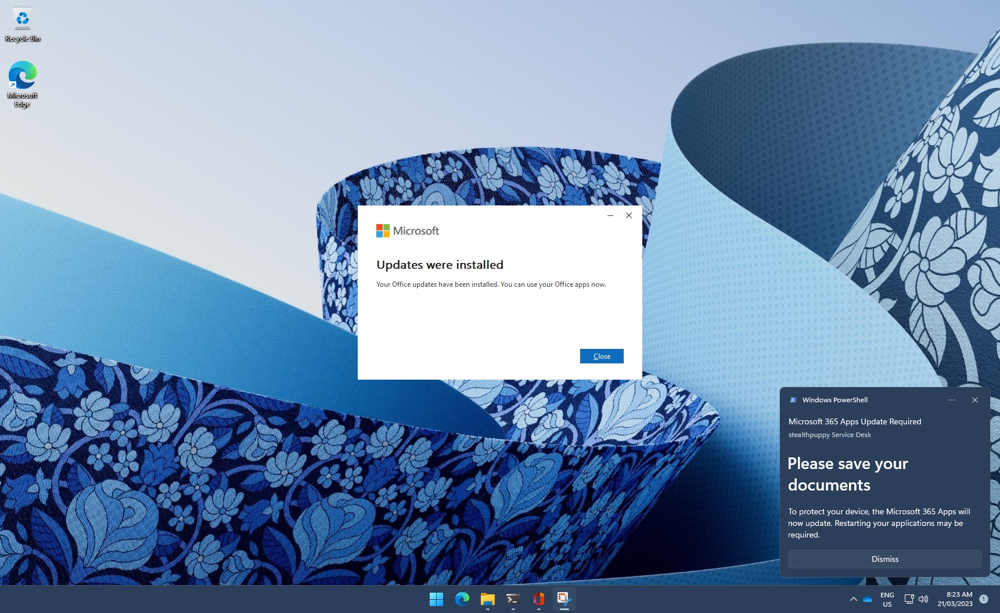

# Update the Microsoft 365 Apps

Detects the installed version of the Microsoft 365 Apps and compares against the minimum required version for that update channel, then invokes an update. Run scripts in the end user context.

A notification is displayed to the end user when the update is invoked.

## Proactive remediation scripts

### Detect and update Microsoft 365 Apps

- `Detect-Microsoft365AppsUpdate.ps1` - reads the installed version and update channel from the Click-to-Run configuration registry key and compares it against the minimum required version for that channel
- `Remediate-Microsoft365AppsUpdate.ps1` - displays a toast notification to the user and invokes `OfficeC2RClient.exe /update user` to trigger an update

The minimum required versions are defined per update channel (Beta, Current, Current Preview, Monthly Enterprise, Perpetual VL 2019/2021, Semi-Annual, Semi-Annual Preview). Update the version numbers in the detect script to reflect the current minimum required versions for your environment.

Run with the following settings:

- `Run script in 64-bit PowerShell` - Yes
- `Run this script using the logged-on credentials` - Yes
